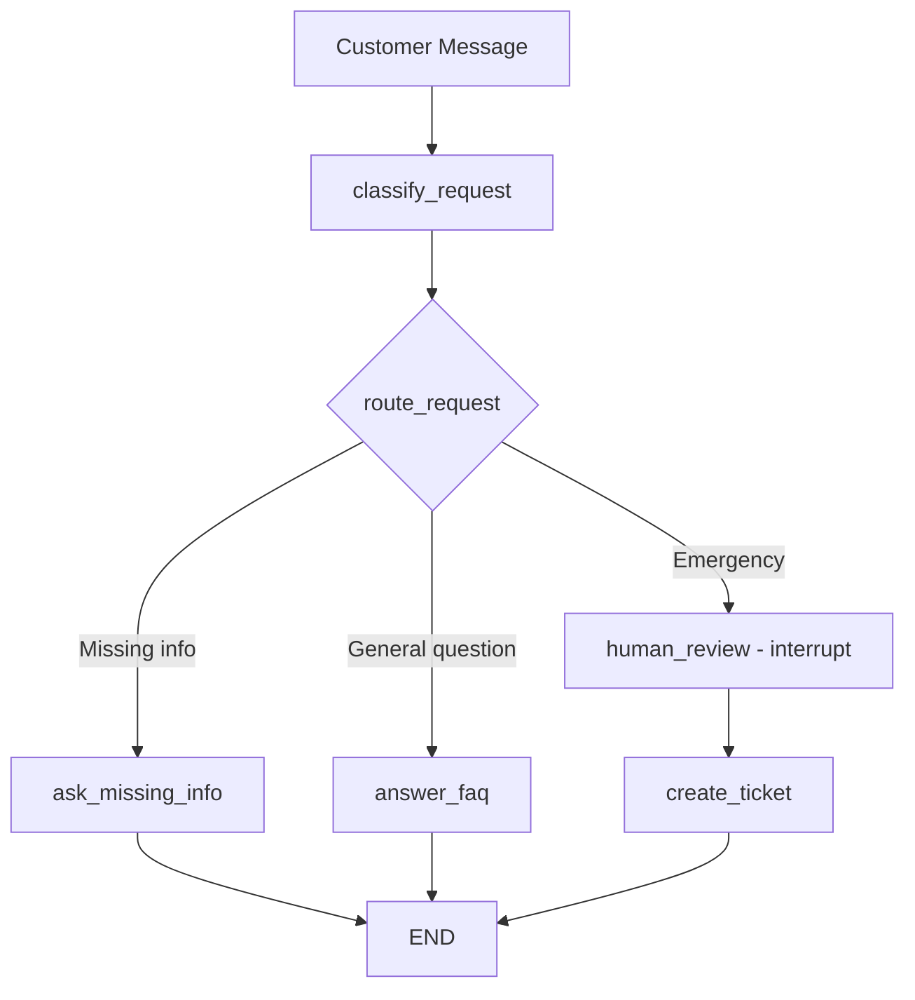

# langgraph-plumberbot-hitl

A minimal **LangGraph human-in-the-loop** portfolio project that demonstrates core LangGraph concepts through a realistic service-triage scenario.

A plumbing company receives customer messages. The LangGraph workflow classifies each message and either asks for missing information, answers a general FAQ, or — for emergencies — **pauses execution and waits for a human dispatcher to approve, reject, or escalate** before creating a dispatch ticket. The graph uses `interrupt()` and `Command(resume=...)` so the human review step is a first-class citizen of the workflow, not an afterthought.

---

## Why this is useful

Human-in-the-loop is one of the most important patterns in production AI systems. This project shows exactly how LangGraph's `interrupt()` mechanism works: the graph checkpoints its full state, pauses mid-execution, waits for a human decision, then resumes from precisely where it stopped. The same pattern applies to content moderation, financial approvals, legal review queues, and any other workflow where automated decisions must be gated by a human.

---

## LangGraph concepts demonstrated

| Concept | Where |
|---|---|
| `StateGraph` | `graph.py` — the container wiring nodes and edges |
| Typed state (`TypedDict`) | `state.py` — `PlumberState` flows through every node |
| Nodes | `nodes.py` — `classify_request`, `ask_missing_info`, `answer_faq`, `human_review`, `create_ticket` |
| Conditional edges | `graph.py` — `route_request()` decides the next node after classification |
| `interrupt()` | `nodes.py:human_review` — pauses the graph for a human decision |
| Checkpointing | `graph.py` — `InMemorySaver` saves state so interrupt/resume works |
| `Command(resume=...)` | `cli.py` — resumes the graph with the human's decision |
| `thread_id` | `cli.py` — ties the initial run and the resume to the same checkpoint |

---

## Graph



---

## Installation

```bash
git clone <this-repo>
cd langgraph-plumberbot-hitl

# Create and activate a virtual environment
python -m venv .venv
source .venv/bin/activate        # Windows: .venv\Scripts\activate

# Install dependencies
pip install -r requirements.txt
```

---

## Running the CLI

```bash
# Run all three scenarios in sequence
python -m plumberbot.cli

# Run a specific scenario
python -m plumberbot.cli --scenario missing
python -m plumberbot.cli --scenario general
python -m plumberbot.cli --scenario emergency
```

---

## Example 1 — Missing information

**Customer message:** `"My sink is leaking."`

```bash
python -m plumberbot.cli --scenario missing
```

**Output:**
```
============================================================
  SCENARIO: Missing Information
============================================================
Customer: 'My sink is leaking.'

Category : missing_info
Missing  : ['address', 'phone number', 'description of issue']

Response :
Thanks for reaching out to PlumberBot!

To help you as quickly as possible, could you please provide:
  • address
  • phone number
  • description of issue
  • A brief description of the issue
  • Is water actively leaking right now? (yes/no)

Reply with these details and we'll get someone out to you promptly.
```

The graph classifies the message as `missing_info` (no address or number found), routes to `ask_missing_info`, and exits. No human review needed.

---

## Example 2 — General question

**Customer message:** `"Do you fix water heaters?"`

```bash
python -m plumberbot.cli --scenario general
```

**Output:**
```
============================================================
  SCENARIO: General Question (FAQ)
============================================================
Customer: 'Do you fix water heaters?'

Category : general

Response :
Thanks for your question!

PlumberBot handles:
  • Leaks and dripping faucets
  • Clogged drains and toilets
  • Water heater installation and repair
  • Sewer line backups
  • Emergency plumbing (burst pipes, flooding)

Give us a call at (555) 123-4567 or reply with your address
and issue description to schedule a visit.
```

FAQ keywords (`"do you"`, `"water heater"`) route directly to `answer_faq`. No human required.

---

## Example 3 — Emergency with human approval

**Customer message:** `"My basement is flooding from a burst pipe. I am at 22 Oak Street."`

```bash
python -m plumberbot.cli --scenario emergency
```

**Phase 1 — graph runs until interrupt:**
```
============================================================
  SCENARIO: Emergency Dispatch (Human-in-the-Loop)
============================================================
Customer: 'My basement is flooding from a burst pipe. I am at 22 Oak Street.'

>>> GRAPH PAUSED — human review required <<<

{
  "message": "Emergency plumbing dispatch requires approval",
  "customer_message": "My basement is flooding from a burst pipe. I am at 22 Oak Street.",
  "urgency_reason": "Emergency keywords detected: ['flooding', 'burst']",
  "options": ["approve", "reject", "escalate"]
}

Options: ['approve', 'reject', 'escalate']
Enter decision [approve / reject / escalate]:
```

**Phase 2 — type `approve` and press Enter:**
```
>>> Resuming graph with decision: 'approve' <<<

Category  : emergency
Decision  : approve
Ticket    : {
  "ticket_id": "PLUMB-001",
  "status": "created",
  "source": "LangGraph MVP",
  "customer_message": "My basement is flooding from a burst pipe. I am at 22 Oak Street."
}

Response  :
Your emergency has been approved for dispatch!

Ticket #PLUMB-001 has been created. A plumber is being dispatched
to your location. You will receive a call within 15 minutes.
```

---

## How human-in-the-loop works

1. The graph reaches the `human_review` node and calls `interrupt(payload)`.
2. LangGraph **checkpoints the full graph state** to `InMemorySaver` and **pauses execution**. The call to `graph.invoke()` returns early with `result["__interrupt__"]` containing the payload.
3. The CLI displays the payload and prompts the human for a decision.
4. The CLI calls `graph.invoke(Command(resume=decision), config=config)` with the **same `thread_id`**.
5. LangGraph loads the saved checkpoint, re-enters `human_review`, and `interrupt()` returns the human's decision.
6. The graph continues to `create_ticket`, which acts on the decision and runs to completion.

The `thread_id` is the key that ties the two `invoke()` calls to the same checkpoint. Change it and you start a fresh conversation with no memory of the previous state.

---

## Running tests

```bash
python -m pytest tests/ -v
```

Tests cover classification and routing logic in isolation — no graph invocation or checkpointer required.

---

## Resume bullet

> Built a minimal LangGraph human-in-the-loop service triage workflow with typed state, conditional routing, checkpointed interrupts, and approval-gated dispatch ticket creation.

---

## Future improvements

- **Add an LLM node** — replace the keyword classifier with a `langchain-anthropic` or `langchain-openai` call for richer understanding
- **Persistent checkpointing** — swap `InMemorySaver` for `SqliteSaver` or `PostgresSaver` so the graph survives process restarts (no code changes to the graph needed)
- **Multi-turn conversation** — add a loop back to `classify_request` so the customer can provide missing information in follow-up messages
- **LangSmith tracing** — set `LANGSMITH_API_KEY` and `LANGCHAIN_TRACING_V2=true` to get a visual trace of every graph run in the LangSmith UI

---

## Deploy to LangGraph Cloud (LangSmith)

LangGraph apps can be deployed to **LangSmith Cloud** (formerly LangGraph Cloud) with a single CLI command. No code changes to the graph are required — LangSmith automatically replaces `InMemorySaver` with durable Postgres-backed checkpointing in production.

**Steps:**

1. Sign up at [smith.langchain.com](https://smith.langchain.com) (requires Plus plan for deployment — see [pricing](https://www.langchain.com/pricing))
2. Add a `langgraph.json` config file to the project root:

```json
{
  "dependencies": ["."],
  "graphs": {
    "plumberbot": "./plumberbot/graph.py:graph"
  },
  "env": ".env"
}
```

3. Install the CLI and deploy:

```bash
pip install langgraph-cli

langgraph dev        # local dev server + LangGraph Studio (free)
langgraph deploy     # push to LangSmith Cloud (requires Plus plan)
```

**Docs:** [LangSmith Deployment](https://docs.langchain.com/langsmith/deployment) · [Application structure](https://docs.langchain.com/langsmith/application-structure) · [CLI reference](https://docs.langchain.com/langsmith/cli)

---

## LangGraph docs referenced

- [StateGraph API](https://docs.langchain.com/oss/python/langgraph/graph-api)
- [Interrupts and HITL](https://docs.langchain.com/oss/python/langgraph/interrupts)
- [Persistence / checkpointing](https://docs.langchain.com/oss/python/langgraph/persistence)
- [Conditional edges](https://docs.langchain.com/oss/python/langgraph/graph-api)
- [LangSmith Deployment quickstart](https://docs.langchain.com/langsmith/deployment-quickstart)
