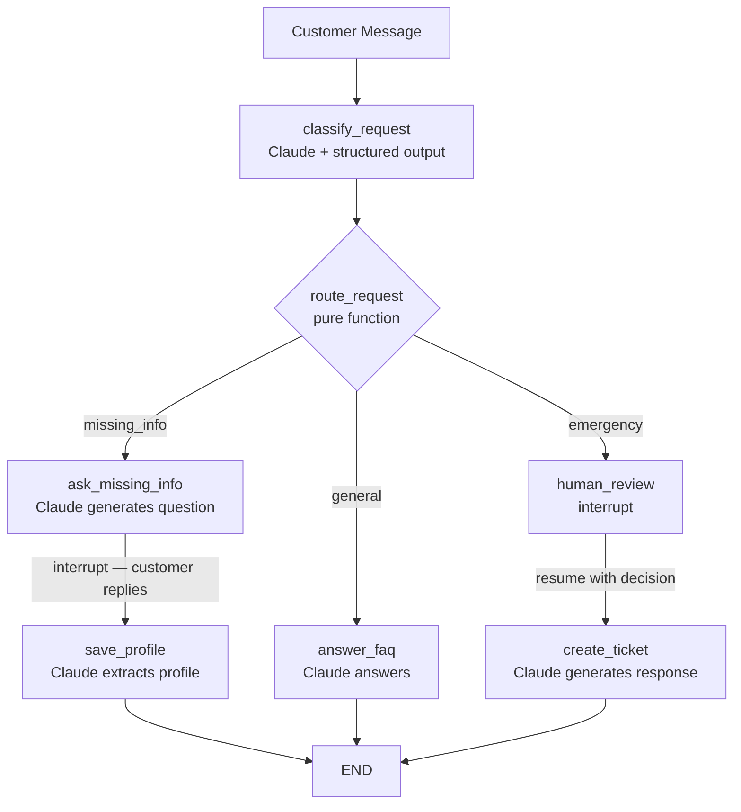

# langgraph-plumberbot-langsmith-03

The same plumbing service triage bot as [`withllm-02`](../langgraph-plumberbot-withllm-02), but now **deployed to LangGraph Cloud** and invoked over HTTP via the **LangGraph SDK**. The graph code is unchanged; what changes is how it runs and how the CLI calls it.

This is the **cloud backend** for the series — a Next.js UI can replace the CLI by making the exact same HTTP calls.

---

## Architecture

```
┌──────────────────────────────┐         HTTP
│   LangGraph Server           │◄────────────────── CLI (Python, langgraph-sdk)
│  (local: langgraph dev)      │
│  (cloud: LangSmith Cloud)    │◄────────────────── Next.js UI (future)
│                              │
│  plumberbot graph + Claude   │
└──────────────────────────────┘
```

Both the CLI and a future Next.js app speak the same REST API — just set `LANGGRAPH_URL`.

---

## What changed from withllm-02

| Concern | withllm-02 | langsmith-03 |
|---|---|---|
| Checkpointer | `InMemorySaver()` in `graph.py` | None — server injects Postgres/Redis |
| CLI | Imports graph directly, `graph.invoke()` | HTTP client, `client.runs.stream()` |
| Interrupt resume | `Command(resume=v)` local | `command={"resume": v}` via SDK |
| Thread persistence | Process lifetime only | Durable across CLI restarts |
| Server | None (in-process) | `langgraph dev` or LangSmith Cloud |

The graph topology, nodes, and Claude prompts are **identical to withllm-02**.

---

## LangGraph concepts demonstrated

| Concept | Where |
|---|---|
| Deploy with `langgraph.json` | `langgraph.json` — registers the graph for the server |
| `langgraph dev` (local server) | Terminal 1 — serves the API at `localhost:2024` + Studio UI |
| `langgraph-sdk` HTTP client | `cli/scenarios.py` — `get_client()`, `client.threads`, `client.runs` |
| Streaming runs | `cli/scenarios.py:_stream_until_done()` — `client.runs.stream(stream_mode="values")` |
| Interrupt detection over HTTP | `cli/scenarios.py:_get_interrupt()` — `client.threads.get_state()` → `state.next` |
| Resume via SDK | `cli/scenarios.py` — `command={"resume": value}` in `client.runs.stream()` |
| Durable thread state | Thread IDs persist; graph can resume after CLI restart |
| Next.js-ready patterns | Every SDK call is commented with its Next.js equivalent |

---

## Graph



---

## Project structure

```
langgraph-plumberbot-langsmith-03/
  plumberbot/            ← SERVER SIDE — deployed to LangGraph Cloud
    state.py             ← PlumberState TypedDict
    nodes.py             ← All graph nodes (Claude-powered)
    llm.py               ← ChatAnthropic init
    graph.py             ← StateGraph compiled WITHOUT checkpointer (server injects it)
  cli/                   ← CLIENT SIDE — runs locally, calls the server over HTTP
    scenarios.py         ← Async scenario functions (Next.js patterns annotated)
    main.py              ← argparse entry point, asyncio.run()
  tests/
    test_routing.py      ← Pure route_request tests (no server needed)
  langgraph.json         ← Deployment config
  requirements.txt       ← Server deps
  requirements-client.txt← Client deps (langgraph-sdk)
```

---

## Installation

```bash
git clone <this-repo>
cd langgraph-plumberbot-langsmith-03

python -m venv .venv
source .venv/bin/activate      # Windows: .venv\Scripts\activate

# Server dependencies (graph + LangGraph Server)
pip install -r requirements.txt
pip install langgraph-cli

# Client dependencies (SDK for the CLI)
pip install -r requirements-client.txt

# Configure credentials
cp .env.example .env
# Edit .env — set ANTHROPIC_API_KEY (and optionally LANGSMITH_API_KEY)
```

---

## Running locally (two terminals)

### Terminal 1 — start the LangGraph Server

```bash
cd langgraph-plumberbot-langsmith-03
langgraph dev
```

Output:
```
Ready!
- API: http://127.0.0.1:2024
- Docs: http://127.0.0.1:2024/docs
- LangGraph Studio: https://smith.langchain.com/studio/?baseUrl=http://127.0.0.1:2024
```

### Terminal 2 — run the CLI

```bash
# Run a specific scenario
python -m cli.main --scenario general
python -m cli.main --scenario missing
python -m cli.main --scenario emergency

# Run all three
python -m cli.main
```

---

## Example 1 — General question

```
Connecting to LangGraph Server at: http://127.0.0.1:2024

============================================================
  SCENARIO: General Question (LLM-powered FAQ)
============================================================
Customer: 'Do you fix water heaters?'

  [Calling Claude to generate FAQ response...]

Category : general

Response :
Absolutely! PlumberBot handles water heater installation and repair,
whether it's a leaky tank, a broken heating element, or a full
replacement. Give us a call at (555) 123-4567 or share your address
to book a visit.
```

---

## Example 2 — Missing information (round-trip interrupt)

```
============================================================
  SCENARIO: Missing Information (LLM-powered)
============================================================
Customer message: 'My sink is leaking.'

  [Calling Claude to classify and generate question...]

Category : missing_info

Bot asks:
Hi there! I'm sorry to hear about your leaking sink — let's get
someone out to you as quickly as possible. Could you please share
your full address, phone number, and a brief description of what's
happening? Also, is water actively leaking or flooding right now?

(Type your details and press Enter)

Customer reply: Jane Doe, 15 Elm Street, (555) 999-1234, slow drip, no flooding

  [Calling Claude to extract profile from reply...]

>>> Graph resumed — saving profile <<<

Profile saved : {
  "status": "saved",
  "name": "Jane Doe",
  "phone": "(555) 999-1234",
  "address": "15 Elm Street",
  "issue": "slow drip under the sink",
  "water_leaking": false
}

Bot response  :
Thank you, Jane! We've saved your profile and will have a plumber
reach out to you at (555) 999-1234 shortly.
```

**SDK pattern used**: stream → `client.threads.get_state()` detects interrupt → `input()` → resume with `command={"resume": reply}`.

---

## Example 3 — Emergency with human approval

```
============================================================
  SCENARIO: Emergency Dispatch (Human-in-the-Loop)
============================================================
Customer: 'My basement is flooding from a burst pipe. I am at 22 Oak Street.'

  [Calling Claude to classify emergency...]

>>> GRAPH PAUSED — human review required <<<

{
  "message": "Emergency plumbing dispatch requires approval",
  "customer_message": "My basement is flooding from a burst pipe. I am at 22 Oak Street.",
  "urgency_reason": "Active flooding from a burst pipe at a known address requires immediate dispatch.",
  "options": ["approve", "reject", "escalate"]
}

Options: ['approve', 'reject', 'escalate']
Enter decision [approve / reject / escalate]: approve

  [Calling Claude to generate response for decision: 'approve'...]

>>> Resuming graph with decision: 'approve' <<<

Category  : emergency
Decision  : approve
Ticket    : {
  "ticket_id": "PLUMB-001",
  "status": "created",
  "source": "LangGraph langsmith-03"
}

Response  :
Your emergency has been received and a plumber is being dispatched
immediately to 22 Oak Street. Ticket #PLUMB-001 is active — please
keep your phone nearby for a call within the next few minutes.
```

**HITL flow**: stream ends at interrupt → SDK polls thread state → CLI prompts human → resume with decision → `create_ticket` runs → END.

---

## Running tests

```bash
python -m pytest tests/ -v
```

`test_routing.py` tests `route_request` in isolation (no API key, no server needed).

---

## Deploying to LangSmith Cloud

Requires a [LangSmith Plus plan](https://www.langchain.com/pricing).

```bash
# Deploy
langgraph deploy

# Copy the deployment URL printed by the command, then update .env:
# LANGGRAPH_URL=https://<deployment-id>.us.langgraph.app

# The CLI works identically against the cloud URL
python -m cli.main --scenario emergency
```

LangSmith Cloud automatically replaces the local SQLite checkpointer with durable Postgres — no code changes needed.

---

## Next.js integration (what this prepares)

The CLI's `scenarios.py` is structured to mirror a Next.js API route. Key mappings:

| CLI (Python) | Next.js (TypeScript) |
|---|---|
| `get_client(url=...)` | `new Client({ apiUrl: process.env.LANGGRAPH_URL })` |
| `client.threads.create()` | `await client.threads.create()` → store `thread_id` |
| `client.runs.stream(...)` | `client.runs.stream(...)` → pipe SSE to browser |
| `client.threads.get_state(id)` | `await client.threads.getState(id)` → check `state.next` |
| `command={"resume": v}` | `command: { resume: v }` in next `runs.stream()` call |
| `LANGGRAPH_URL` env var | `process.env.LANGGRAPH_URL` (same pattern) |

The deployed LangGraph Cloud endpoint is CORS-enabled — a Next.js Route Handler or Server Action can call it directly.

---

## Default model

`claude-sonnet-4-6` — override via `ANTHROPIC_MODEL` in `.env`.

---

## Resume bullet

> Deployed a LangGraph HITL plumbing triage bot to LangGraph Cloud; built an async Python CLI using the LangGraph SDK that streams runs, detects interrupts via thread state polling, and resumes with dispatcher decisions — mirroring the exact HTTP call pattern a Next.js frontend would use.
