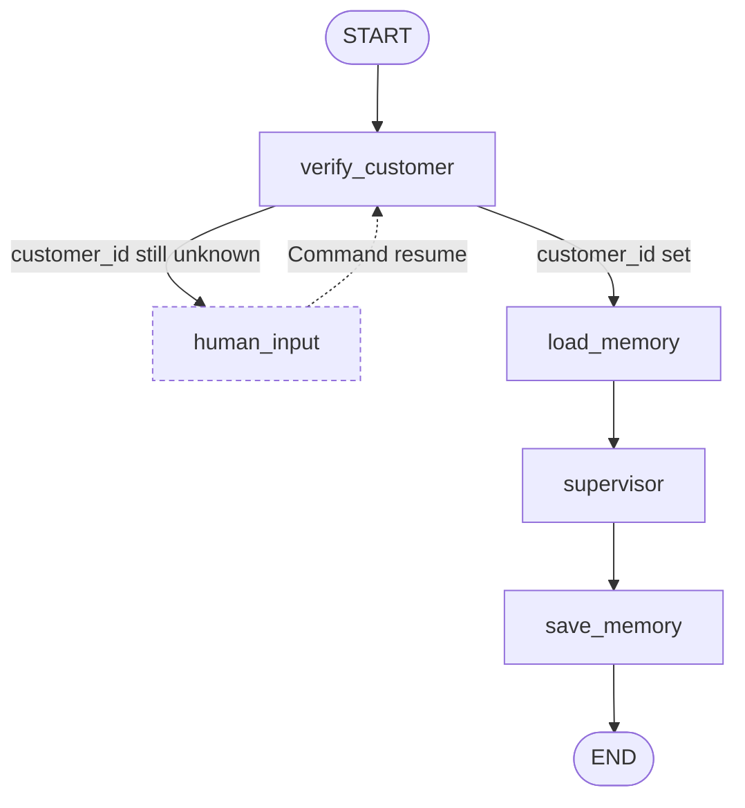
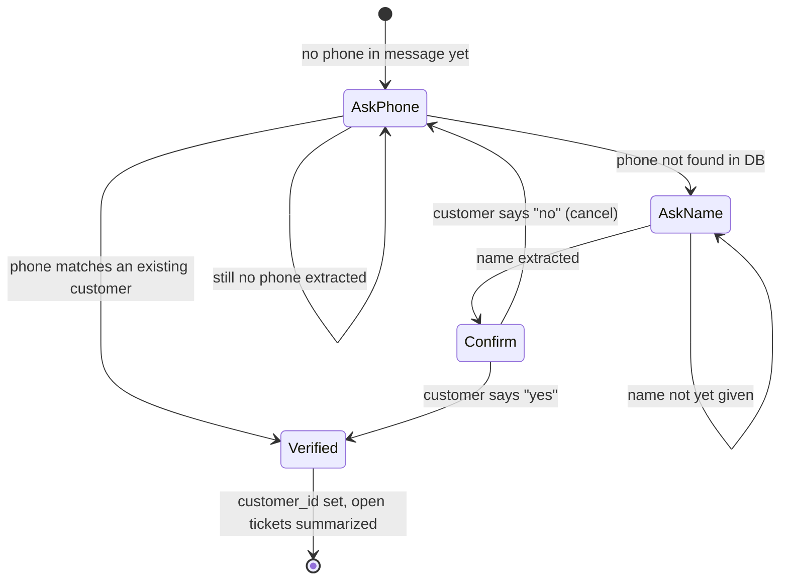
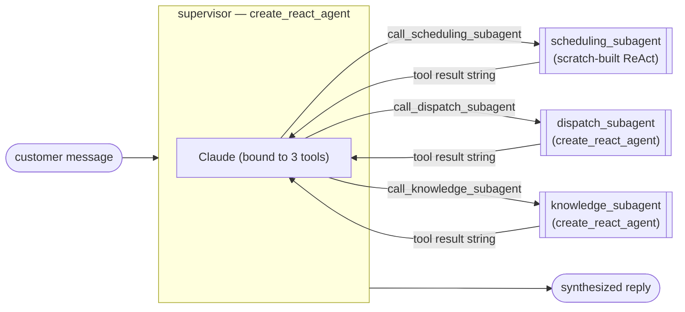
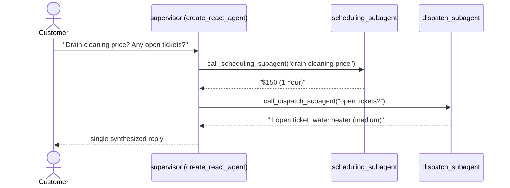
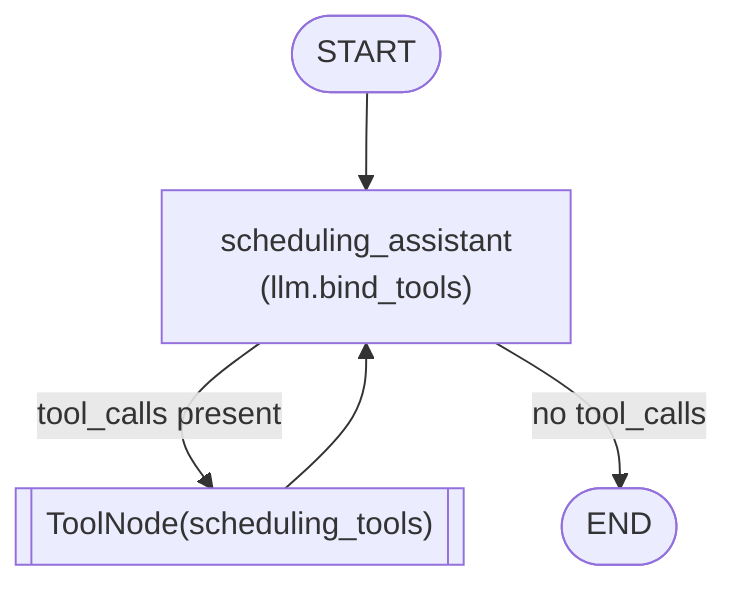

# langgraph-plumberbot-multiagent-05

**Multi-agent** extension of the plumberbot series. A supervisor agent routes customer
requests to three specialist sub-agents, each with their own tools and domain focus.
Includes a pre-seeded business SQLite database committed to git and an in-memory
RAG knowledge base over plumbing how-to articles.

Both a CLI (withllm-02 style) and a Gradio web UI (hugging-04 style) are included.

---

## Architecture

This project is three graphs stacked on top of each other:

1. An **outer `StateGraph`** that verifies the customer, loads/saves long-term
   memory, and hands the conversation to...
2. A **supervisor**, itself a `create_react_agent`, whose only "tools" are
   three specialist subagents, each of which is...
3. A **subagent** — a small ReAct loop with its own domain-specific tools
   (SQL queries, vector search).

Because `create_react_agent` just compiles down to a normal `StateGraph`, a
subagent-as-tool and a hand-wired `StateGraph` node are structurally the same
shape — one is prebuilt, one is spelled out. This project shows both, side by
side, so you can see the shortcut and the thing it's a shortcut *for*.

### 1. The outer graph — verification, memory, dispatch to supervisor



`verify_customer` is a single node, but it's a small internal state machine —
it loops through the `human_input` interrupt until it either matches an
existing phone number or walks a brand-new caller through self-registration:



Every transition above is one call to `verify_customer` — the `human_input`
node in the outer graph is what pauses execution (via `interrupt()`) and
resumes it (via `Command(resume=...)`) between each stage. Once `customer_id`
is set, `should_interrupt` routes to `load_memory` instead of back to
`human_input`, breaking the loop.

### 2. The supervisor — routes to subagents-as-tools

The supervisor never talks to `scheduling_subagent` as a graph node. Instead,
each subagent is wrapped in a plain `@tool` function that the supervisor's
LLM can call like any other tool — the [LangChain subagents
pattern](https://docs.langchain.com/oss/python/langchain/multi-agent/subagents).
The wrapper `.invoke()`s the subagent synchronously and hands its final
message back as a string:



`customer_id` and `loaded_memory` reach the scheduling/dispatch tool wrappers
via `InjectedState` — the supervisor's LLM never sees or passes them, they're
pulled straight out of the outer graph's state:

```python
@tool
def call_scheduling_subagent(
    query: str,
    customer_id: Annotated[Optional[int], InjectedState("customer_id")],
    loaded_memory: Annotated[str, InjectedState("loaded_memory")],
) -> str:
    """Route to the scheduling subagent for appointments, service catalog, and plumber availability."""
    result = _scheduling.invoke({
        "messages": [HumanMessage(content=query)],
        "customer_id": customer_id,
        "loaded_memory": loaded_memory,
    })
    return result["messages"][-1].content
```

A request that spans domains (e.g. "what's this cost, and do I have any open
tickets?") gets routed to more than one subagent in the same supervisor turn:



### 3. Two ways to build a subagent

All three subagents look identical from the supervisor's side (a `.invoke()`
call returning `{"messages": [...]}`), but they're built two different ways
to show the shortcut and the thing underneath it:

| Pattern | Used by | Key idea |
|---|---|---|
| **Scratch-built ReAct** | `scheduling_subagent` | `llm.bind_tools()` + `ToolNode` + `StateGraph`, wired by hand |
| **`create_react_agent`** | `dispatch_subagent`, `knowledge_subagent`, `supervisor` | prebuilt shortcut — same graph shape, less boilerplate |

**Scratch-built** (`agents/scheduling.py`) — this is what `create_react_agent`
is doing for you under the hood:



```python
def _should_continue(state: PlumberState) -> str:
    """Route to tools if the LLM made a tool call, otherwise finish."""
    return "continue" if state["messages"][-1].tool_calls else "end"

graph = StateGraph(PlumberState)
graph.add_node("scheduling_assistant", _scheduling_assistant)
graph.add_node("tools", ToolNode(scheduling_tools))
graph.add_edge(START, "scheduling_assistant")
graph.add_conditional_edges(
    "scheduling_assistant", _should_continue, {"continue": "tools", "end": END},
)
graph.add_edge("tools", "scheduling_assistant")
```

`ToolNode` reads the graph's `PlumberState` directly, so tool parameters
annotated with `InjectedState("customer_id")` get filled in automatically —
the LLM never has to guess or pass a customer ID.

**`create_react_agent`** (`agents/dispatch.py`, `agents/knowledge.py`) — the
exact same assistant → tools → assistant loop, built in one call:

```python
def build_dispatch_subagent():
    return create_react_agent(
        model=llm,
        tools=dispatch_tools,
        prompt=_make_prompt,          # dynamic: injects loaded_memory
        name="dispatch_subagent",
        state_schema=PlumberState,    # same InjectedState mechanism applies
    )
```

### What each layer does

| Layer | Pattern | Purpose |
|---|---|---|
| Outer graph | `StateGraph` | Verification (with self-registration), memory, top-level flow |
| Supervisor | `create_react_agent` | Routes requests to the right subagent(s) |
| Subagents | scratch-built ReAct / `create_react_agent` | Specialist tools per domain |
| Subagent tools | `@tool` + `InjectedState` | Query SQLite, call vectorstore |
| Knowledge base | `InMemoryVectorStore` or `BM25Retriever` | RAG over 5 how-to articles |
| Persistence | `SqliteSaver` | Conversation checkpoints |
| Long-term memory | `customer_profile` table | Preferences survive sessions |

### Subagent tools at a glance

| Subagent | Tools |
|---|---|
| `scheduling_subagent` | `get_customer_info`, `get_service_catalog`, `get_appointments`, `get_available_plumbers`, `book_appointment` |
| `dispatch_subagent` | `get_open_tickets`, `get_all_tickets`, `create_ticket`, `get_plumber_on_call` |
| `knowledge_subagent` | `search_knowledge_base`, `list_articles` |

All tools that need to know *who's asking* (`get_customer_info`,
`get_appointments`, `book_appointment`, `get_open_tickets`,
`get_all_tickets`, `create_ticket`) take `customer_id` as an
`InjectedState("customer_id")` parameter — it's stripped from the schema the
LLM sees and filled in from graph state at call time.

---

## LangGraph concepts demonstrated

| Concept | Where |
|---|---|
| `ToolNode` (manual ReAct) | `agents/scheduling.py` — `_tool_node = ToolNode(scheduling_tools)` |
| `llm.bind_tools()` | `agents/scheduling.py` — bound once at module level |
| `should_continue` edge | `agents/scheduling.py:_should_continue` |
| `create_react_agent` | `agents/dispatch.py`, `agents/knowledge.py`, `agents/supervisor.py` |
| `InjectedState` | All DB tools — auto-injects `customer_id` from graph state |
| `ToolNode` + `InjectedState` | `ToolNode` reads the graph state and injects annotated values automatically |
| Supervisor → subagent-as-tool | `agents/supervisor.py` — subagents called inside `@tool` |
| Customer verification + self-registration + HITL | `nodes.py:verify_customer` + `human_input` |
| Long-term memory (SQL) | `nodes.py:load_memory`, `save_memory` + `customer_profile` |
| RAG dual backend | `knowledge.py:get_retriever` — OpenAI vector or BM25 |
| Messages-based state | `Annotated[list[AnyMessage], add_messages]` |
| `InputState` schema | Restricts external callers to `messages` only |
| `SqliteSaver` checkpoint | `app.py` — persists threads across page refreshes |

---

## Database (`db/plumberbot.db`)

Six tables, pre-seeded and committed to git — no setup required:

| Table | Rows | Purpose |
|---|---|---|
| `customers` | 6 | Name, phone, email, address |
| `service_catalog` | 10 | Services with base price and typical hours |
| `plumbers` | 4 | Staff with specialties and on-call flag |
| `appointments` | 6 | Scheduled and completed jobs |
| `tickets` | 5 | Open and resolved service tickets |
| `customer_profile` | 3 | Long-term memory (preferences, history) |

To recreate the database from scratch:
```bash
python db/seed.py
```

---

## Knowledge Base (`docs/`)

Five plumbing how-to articles loaded into an in-memory vector store at startup:

| File | Topics |
|---|---|
| `fix_a_sink.txt` | Leaky faucet, slow drain, P-trap, supply lines |
| `fix_a_toilet.txt` | Running toilet, weak flush, clogs, wax ring |
| `fix_a_water_heater.txt` | No hot water, pilot light, anode rod, flushing |
| `burst_pipe_emergency.txt` | Immediate steps, shut-off location, temporary fixes |
| `drain_cleaning_tips.txt` | DIY methods, what not to pour, maintenance schedule |

**RAG backend — auto-selected at startup:**
- `OPENAI_API_KEY` set → `InMemoryVectorStore` with `text-embedding-3-small` (semantic search)
- Anthropic key only → `BM25Retriever` (keyword search, no extra API key needed)

Both backends use the same `search_knowledge_base` tool — the knowledge subagent is unaware of which is active.

---

## Setup

### API keys

This project needs **one required key** and one **optional key** that upgrades the RAG backend:

| Key | Required | Used for |
|---|---|---|
| `ANTHROPIC_API_KEY` | **Yes** | All LLM generation — classification, responses, memory extraction |
| `OPENAI_API_KEY` | No | RAG embeddings (`text-embedding-3-small`) — upgrades knowledge search from keyword to semantic |

**With `ANTHROPIC_API_KEY` only:**
The knowledge subagent uses **BM25 keyword search**. Works well for the plumbing corpus because the articles have specific technical vocabulary ("flapper", "P-trap", "anode rod"). All other features (scheduling, dispatch, memory, verification) are unaffected.

**With both keys:**
The knowledge subagent uses **OpenAI semantic vector search** (`text-embedding-3-small`, ~$0.00002 per query). Embeddings are generated once at startup and cached in memory for the session.

> Anthropic does not currently offer an embeddings API — it focuses exclusively on generation models.

---

## Local development

### 1 — Install dependencies

```bash
cd langgraph-plumberbot-multiagent-05
python -m venv .venv
source .venv/bin/activate   # Windows: .venv\Scripts\activate
pip install -r requirements.txt
```

### 2 — Configure environment

```bash
cp .env.example .env
```

Edit `.env` and set your keys. **Minimum (Anthropic only — BM25 knowledge search):**

```env
ANTHROPIC_API_KEY=sk-ant-...
```

**Full setup (Anthropic + OpenAI — semantic vector knowledge search):**

```env
ANTHROPIC_API_KEY=sk-ant-...
OPENAI_API_KEY=sk-...
```

You can confirm which RAG backend was selected by checking the startup log:
```
[knowledge] RAG backend: OpenAI vector (text-embedding-3-small) — 65 chunks loaded
# or
[knowledge] RAG backend: BM25 keyword (no API key required) — 65 chunks loaded
```

### 3 — Run the CLI

```bash
python cli.py
```

The database is pre-seeded, so you can start immediately with any customer's phone number.

### 4 — Run the Gradio UI

```bash
python app.py
# Open http://localhost:7860
```

---

## Scenario walkthroughs

### Scenario 1 — Returning customer: scheduling

```
You: My phone is (555) 111-2222. I need to book a drain cleaning.
PlumberBot: Welcome back, Jane Doe! I've verified your account...
            [supervisor → scheduling_subagent]
            → lists available plumbers → suggests Mike Torres or Lisa Chen
            → confirms appointment booked
```

### Scenario 2 — Returning customer: emergency dispatch

```
You: My number is (555) 333-4444. I have a burst pipe, water everywhere!
PlumberBot: Welcome back, Bob Smith!
            [supervisor → dispatch_subagent]
            → creates emergency ticket (priority: emergency)
            → returns on-call plumber: Mike Torres, (555) 200-0001
```

### Scenario 3 — Returning customer: RAG knowledge

```
You: My phone is (555) 111-2222. How do I fix a running toilet?
PlumberBot: Welcome back, Jane Doe!
            [supervisor → knowledge_subagent → search_knowledge_base("running toilet")]
            → returns tips from fix_a_toilet.txt
            → explains flapper replacement, float adjustment
```

### Scenario 4 — Multi-intent

```
You: My number is (555) 333-4444. What are your drain cleaning prices,
     and do I have any open tickets?
PlumberBot: Welcome back, Bob Smith!
            [supervisor → scheduling_subagent + dispatch_subagent (parallel)]
            → Drain Cleaning: $150 (1 hour)
            → 1 open ticket: water heater issue (medium priority)
```

### Scenario 5 — Second conversation (memory in action)

```
You: My phone is (555) 111-2222. Can I book something?
PlumberBot: Welcome back, Jane Doe! Based on your profile, I know you prefer
            morning appointments (8am–12pm)...
```

### Scenario 6 — New customer self-registration

```
You: My phone is (555) 000-9999. I need help.
PlumberBot: I couldn't find an account with (555) 000-9999. Would you like to
            create a new account? If so, please tell me your full name.
You: Sure, it's Alex Rivera.
PlumberBot: Got it! I'll create a new account for Alex Rivera with phone
            number (555) 000-9999. Does that look right? (yes / no)
You: yes
PlumberBot: Account created! Welcome, Alex Rivera. Your account is now
            active. How can I help you today?
            [customer_id set → supervisor handles the original request]
```

`verify_customer` walks this as a 3-stage loop through the `human_input`
interrupt (see the state diagram above) — if the customer had given their
name in the very first message, it collapses straight to the confirmation
step instead.

---

## Running tests

```bash
# DB tool tests (no API key required)
python -m pytest tests/test_tools.py -v

# RAG tests (requires OPENAI_API_KEY)
python -m pytest tests/test_rag.py -v

# All tests
python -m pytest tests/ -v
```

---

## Deploying to Hugging Face Spaces

### Step 1 — Create a Space

1. Go to [huggingface.co/spaces](https://huggingface.co/spaces) → **Create new Space**
2. Settings: **SDK: Docker**, **Template: Blank**

### Step 2 — Add Secrets

In Space settings → **Variables and secrets**:

| Name | Value | Required |
|---|---|---|
| `ANTHROPIC_API_KEY` | `sk-ant-...` | Yes |
| `OPENAI_API_KEY` | `sk-...` | No — enables semantic RAG; without it, BM25 keyword search is used |
| `ANTHROPIC_MODEL` | `claude-opus-4-8` | No |
| `CHECKPOINT_DB_PATH` | `/data/plumberbot_checkpoints.db` | Only on Pro tier |

### Step 3 — Push the code

```bash
cd /path/to/langgraph-plumberbot   # monorepo root

# One-time: add the HF Space remote
git remote add space https://huggingface.co/spaces/<your-username>/<space-name>

# Push just the multiagent-05 subfolder
git subtree push --prefix langgraph-plumberbot-multiagent-05 space main
```

If rejected (HF auto-created a commit):
```bash
git push space $(git subtree split --prefix langgraph-plumberbot-multiagent-05):main --force
```

### Step 4 — Watch the build

Click **Logs** in the Space UI. Build takes ~3 minutes on first push (OpenAI embeddings are computed at startup, not at build time).

---

## Local Docker test

```bash
docker build -t plumberbot-multi .
docker run -p 7860:7860 \
  -e ANTHROPIC_API_KEY=sk-ant-... \
  -e OPENAI_API_KEY=sk-... \
  plumberbot-multi
# Open http://localhost:7860
```

---

## What changed from hugging-04

| Concern | hugging-04 | multiagent-05 |
|---|---|---|
| Architecture | Single graph, 5 nodes | Outer graph + supervisor + 3 subagents |
| State | `customer_message`, `category`, etc. | `messages`, `customer_id`, `loaded_memory` |
| Agents | No (direct node functions) | `create_react_agent` for each specialist |
| Tools | No | 11 tools across 3 domains |
| DB | None (SQLite for checkpoints only) | Business DB with 6 tables + checkpoint DB |
| Knowledge | None | RAG over 5 articles (`InMemoryVectorStore`) |
| Memory | Thread-level only | Long-term via `customer_profile` table |
| Identity | None | Phone number verification (HITL), with self-registration for new callers |
