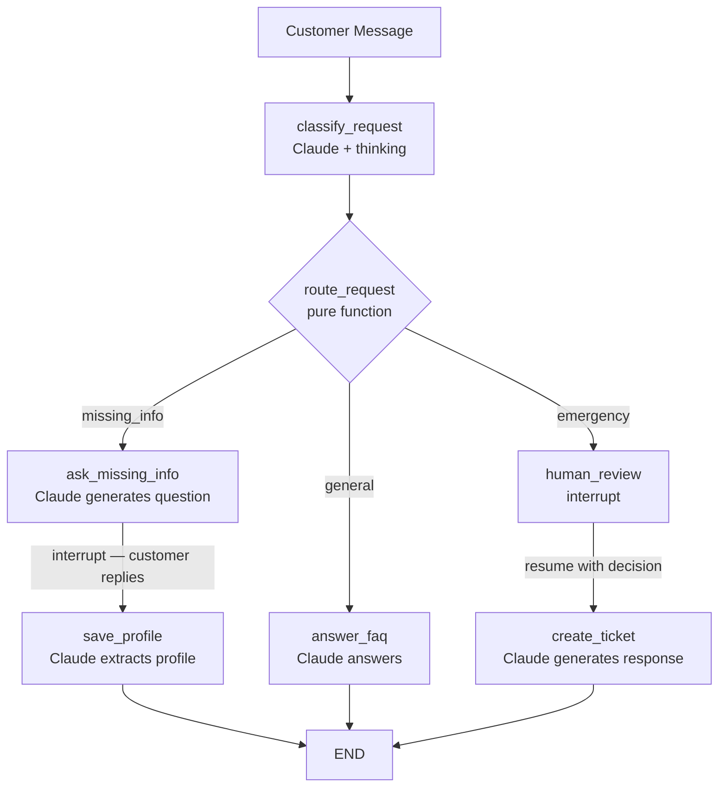

# langgraph-plumberbot-withllm-02

The same plumbing service triage bot as [`bare-01`](../langgraph-plumberbot-bare-01), but every classification and response is now generated by **Claude** (Anthropic API) instead of keyword matching.

The graph **topology is unchanged**: same nodes, same edges, same `interrupt()`/`Command(resume=...)` HITL pattern. What changed is that deterministic `if/elif` logic has been replaced by Claude calls, making the bot far more robust to natural language variation.

---

## What changed from bare-01

| Node | bare-01 | withllm-02 |
|---|---|---|
| `classify_request` | regex + keyword matching | `client.messages.create()` with JSON schema output + adaptive thinking |
| `ask_missing_info` | template string | `client.messages.create()` — generates warm, context-aware question |
| `save_profile` | simple dict from keywords | `client.messages.parse()` — extracts structured `CustomerProfile` from free text |
| `answer_faq` | static FAQ bullet list | `client.messages.create()` — natural language answer |
| `create_ticket` | static response string | `client.messages.create()` — professional response based on decision |
| `human_review` | unchanged | unchanged (`interrupt()`, no LLM) |
| `route_request` | unchanged | unchanged (pure function) |

---

## LangGraph concepts demonstrated

| Concept | Where |
|---|---|
| `StateGraph` | `graph.py` — unchanged topology from bare-01 |
| Typed state (`TypedDict`) | `state.py` — `PlumberState` identical to bare-01 |
| LLM nodes | `nodes.py` — `classify_request`, `answer_faq`, `ask_missing_info`, `save_profile`, `create_ticket` |
| Structured output (JSON schema) | `nodes.py:classify_request` — `output_config.format.json_schema` |
| Structured output (Pydantic) | `nodes.py:save_profile` — `client.messages.parse(output_format=CustomerProfile)` |
| Adaptive thinking | `nodes.py:classify_request` — `thinking={"type": "adaptive"}` |
| Conditional edges | `graph.py` — `route_request()` still a pure routing function |
| `interrupt()` | `nodes.py:human_review` and `nodes.py:ask_missing_info` |
| Checkpointing | `graph.py` — `InMemorySaver` (same as bare-01) |
| `Command(resume=...)` | `cli.py` — identical resume pattern |

---

## Graph



---

## How Claude is used

### Classification — structured JSON output + adaptive thinking

```python
response = client.messages.create(
    model=MODEL,
    max_tokens=4096,
    thinking={"type": "adaptive"},          # model reasons before answering
    system=CLASSIFY_SYSTEM,
    messages=[{"role": "user", "content": customer_message}],
    output_config={
        "format": {
            "type": "json_schema",
            "schema": {
                "type": "object",
                "properties": {
                    "category": {"type": "string", "enum": ["emergency", "general", "missing_info"]},
                    "urgency_reason": {"type": "string"},
                    "missing_fields": {"type": "array", "items": {"type": "string"}},
                },
                "required": ["category", "urgency_reason", "missing_fields"],
                "additionalProperties": False,
            },
        }
    },
)
text_block = next(b for b in response.content if b.type == "text")
data = json.loads(text_block.text)
```

### Profile extraction — Pydantic structured output

```python
class CustomerProfile(BaseModel):
    name: str = Field(default="Unknown")
    phone: str = Field(default="not provided")
    address: str = Field(default="not provided")
    issue_description: str = Field(default="")
    water_actively_leaking: bool = Field(default=False)

extraction = client.messages.parse(
    model=MODEL,
    max_tokens=1024,
    system="Extract customer contact and issue details.",
    messages=[{"role": "user", "content": customer_reply}],
    output_format=CustomerProfile,          # validated Pydantic instance
)
data: CustomerProfile = extraction.parsed_output
```

---

## Installation

```bash
git clone <this-repo>
cd langgraph-plumberbot-withllm-02

# Create and activate a virtual environment
python -m venv .venv
source .venv/bin/activate        # Windows: .venv\Scripts\activate

# Install dependencies
pip install -r requirements.txt

# Set your Anthropic API key
cp .env.example .env
# Edit .env and add: ANTHROPIC_API_KEY=sk-ant-...
```

---

## Running the CLI

```bash
# Run all three scenarios
python -m plumberbot.cli

# Run a specific scenario
python -m plumberbot.cli --scenario missing
python -m plumberbot.cli --scenario general
python -m plumberbot.cli --scenario emergency
```

---

## Example 1 — Missing information (LLM round-trip)

```bash
python -m plumberbot.cli --scenario missing
```

```
Model: claude-opus-4-8

============================================================
  SCENARIO: Missing Information (LLM-powered)
============================================================
Customer message: 'My sink is leaking.'

  [Calling Claude to classify and generate question...]

Category : missing_info

Bot asks:
Hi there! I'm sorry to hear about your leaking sink — let's get
someone out to you as quickly as possible. Could you please share
your full address, phone number, and a brief description of what's
happening? Also, is water actively leaking or flooding right now?

(Type your details and press Enter)

Customer reply: Jane Doe, 15 Elm Street, (555) 999-1234, slow drip under the sink, no flooding

  [Calling Claude to extract profile from reply...]

>>> Graph resumed — saving profile <<<

Profile saved : {
  "status": "saved",
  "name": "Jane Doe",
  "phone": "(555) 999-1234",
  "address": "15 Elm Street",
  "issue": "slow drip under the sink",
  "water_leaking": false
}

Bot response  :
Thank you, Jane! We've saved your profile and will have a plumber
reach out to you at (555) 999-1234 shortly.
```

**What's new vs bare-01**: Claude generates the question in natural language (not a template), then `client.messages.parse()` extracts a typed `CustomerProfile` from the free-text reply.

---

## Example 2 — General question

```bash
python -m plumberbot.cli --scenario general
```

```
============================================================
  SCENARIO: General Question (LLM-powered FAQ)
============================================================
Customer: 'Do you fix water heaters?'

  [Calling Claude to generate FAQ response...]

Category : general

Response :
Absolutely! PlumberBot handles water heater installation and repair,
whether it's a leaky tank, a broken heating element, or a full
replacement. Give us a call at (555) 123-4567 or share your address
to book a visit.
```

---

## Example 3 — Emergency with human approval

```bash
python -m plumberbot.cli --scenario emergency
```

```
============================================================
  SCENARIO: Emergency Dispatch (Human-in-the-Loop)
============================================================
Customer: 'My basement is flooding from a burst pipe. I am at 22 Oak Street.'

  [Calling Claude to classify emergency...]

>>> GRAPH PAUSED — human review required <<<

{
  "message": "Emergency plumbing dispatch requires approval",
  "customer_message": "My basement is flooding from a burst pipe. I am at 22 Oak Street.",
  "urgency_reason": "Active flooding from a burst pipe at a known address requires immediate dispatch.",
  "options": ["approve", "reject", "escalate"]
}

Options: ['approve', 'reject', 'escalate']
Enter decision [approve / reject / escalate]: approve

  [Calling Claude to generate response for decision: 'approve'...]

>>> Resuming graph with decision: 'approve' <<<

Category  : emergency
Decision  : approve
Ticket    : {
  "ticket_id": "PLUMB-001",
  "status": "created",
  "source": "LangGraph withllm-02"
}

Response  :
Your emergency has been received and a plumber is being dispatched
immediately to 22 Oak Street. Ticket #PLUMB-001 is active — please
keep your phone nearby for a call within the next few minutes.
```

**HITL flow is identical to bare-01**: interrupt → human decision → resume → create_ticket. Only the `urgency_reason` text and the final response are now LLM-generated.

---

## Running tests

```bash
python -m pytest tests/ -v
```

`test_routing.py` tests `route_request` (a pure function) without any API calls. LLM-dependent nodes require a real `ANTHROPIC_API_KEY` and are integration tests not included here.

---

## Default model

`claude-sonnet-4-6` — override via `ANTHROPIC_MODEL` in `.env`.

---

## Deploy to LangGraph Cloud (LangSmith)

Same deployment path as `bare-01` — `langgraph.json` is already present:

```bash
pip install langgraph-cli
langgraph dev     # local dev server + LangGraph Studio
langgraph deploy  # push to LangSmith Cloud (requires Plus plan)
```

Remember to set `ANTHROPIC_API_KEY` as an environment variable in your LangSmith deployment config.

---

## Resume bullet

> Built a LangGraph HITL service triage bot powered by the Anthropic API: structured JSON output with adaptive thinking for classification, Pydantic-validated profile extraction, and natural language response generation — all wired into the same interrupt/resume checkpointing pattern as the deterministic baseline.
